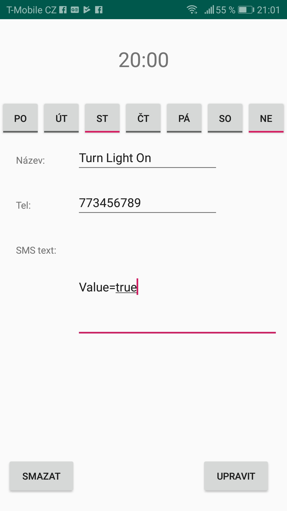
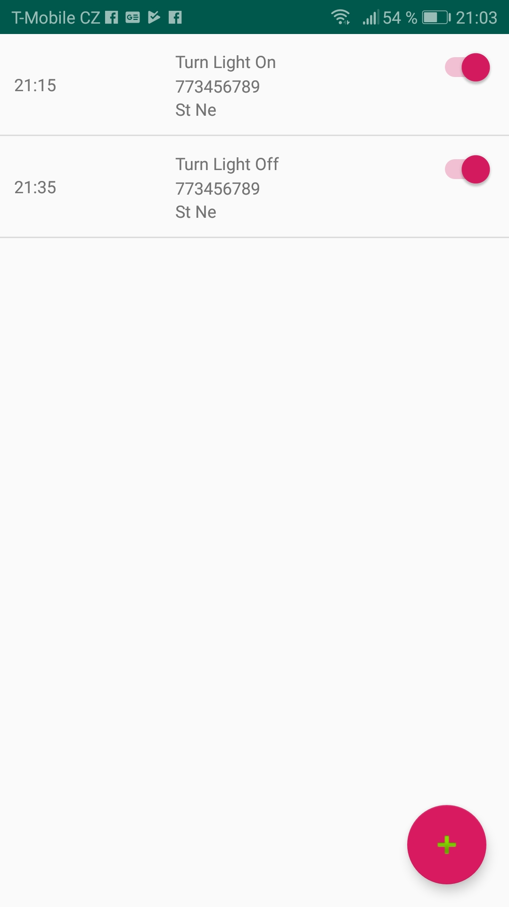

# TextMachine
## Autor: Petr Filák
### Tato aplikace vznikla za účelem ovládání embeded zařízení vybavená GSM moduly.
### Uživatel vytváří jednotlivé události ve kterých nastavuje:
###                 - čas odesílání
###                 - dny, ve které se bude sms periodicky odesílat
###                 - telefonní číslo příjemce (zařízení)
###                 - název události
###                 - text zprávy
### Jednotlivé události lze upravovat, mazat, nebo pouze deaktivovat 
### aplikace běží na pozadí operačního systému

